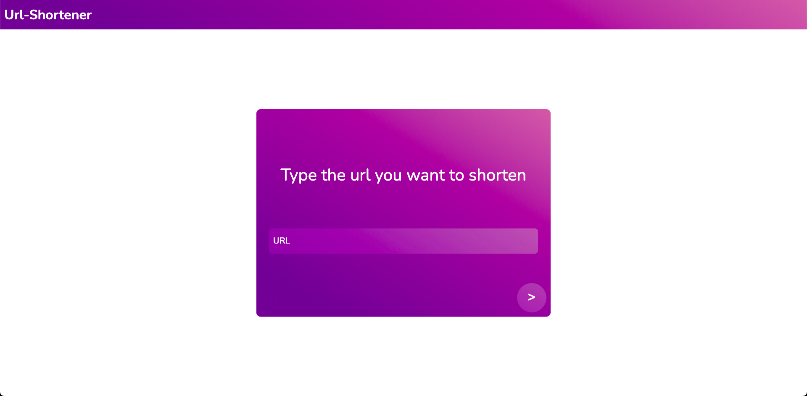

<h1 align="center">
    UrlShortener
</h1>

<p align="center">
  <a href="#-project">Project</a>&nbsp;&nbsp;&nbsp;|&nbsp;&nbsp;&nbsp;
  <a href="#rocket-technologies">Technologies</a>&nbsp;&nbsp;&nbsp;|&nbsp;&nbsp;&nbsp;
  <a href="#information_source-how-to-run">How to run</a>&nbsp;&nbsp;&nbsp;|&nbsp;&nbsp;&nbsp;

</p>

<br>

<p align="center">
  
</p>

## 💻 Project

This is just a very simple url shortener made in Golang.

## :rocket: Technologies

This app was made using the following technologies:
- [Go][go]
- [Javascript][javascript]
- [Docker][docker]
## :information_source: How To Run

To clone and run this application, you'll need [Git](https://git-scm.com) + [Docker][docker] + [Docker-Compose][doker-compose] + Web Browser installed on your computer.

### Clone and Run the server

<br/>

```bash
# Clone this repository
$ git clone https://github.com/lucastssb/urlshortener.git

# Go into the repository
$ cd urlshotener/Server

# Run containers
$ docker compose up

# The rest server will be available on localhost:8080
# Access "http://localhost:8080/Bzgbai" on your web browser and see what happens


```

### Create new short url

Send a http POST request to "localhost:8080/create" with a JSON on its body

<br/>
Example:

```bash
{
    "url": "http://facebook.com"
}
```
If everything worked out you will get the following response from the server

```bash
{
    "urlShorten": "/XVlBzg"
}
```
### To run the web page just go into the folder "urlshotener/Web" and open the "index.html" file on your web browser.

<br>

Made with ♥ by Lucas Barbosa :wave: [Get in touch!](https://www.linkedin.com/in/lucas-barbosa-60b56416b/)

[go]: https://golang.org/
[javascript]: https://developer.mozilla.org/pt-BR/docs/Web/JavaScript
[docker]: https://www.docker.com/
[doker-compose]: https://docs.docker.com/compose/install/

